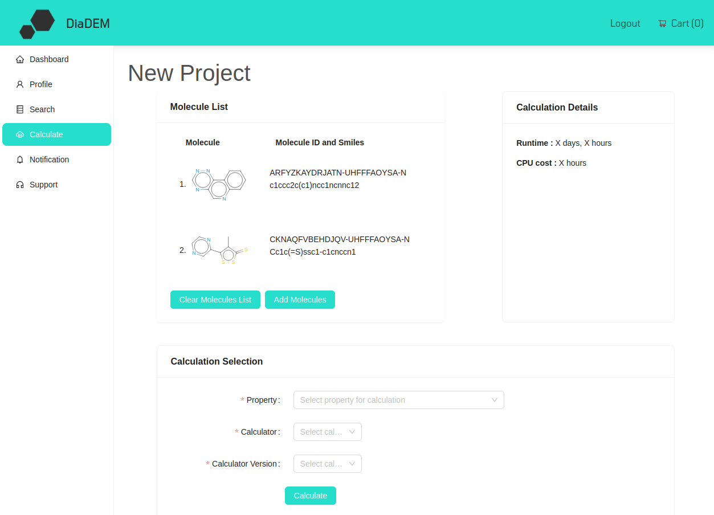
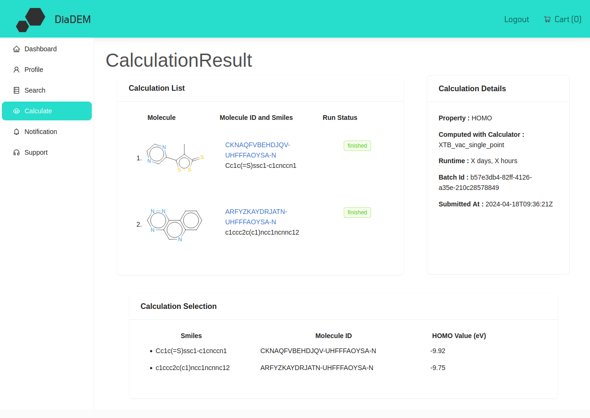

.. _manual_ondemand:

On-demand calculations
======================

Introduction
------------

You can conduct on-demand on compounds you are interested in using various methods. Information on the properties you can compute on demand and details on the methods can be found in the sections :ref:`science_properties` and :ref:`science_calculators`.

Setting up an on-demand calculation
------------------------------------

We plan to provide functionality to run on-demand calculations on any molecule of your choice (e.g. provided via upload) in the near future. As of now, **your starting point** for an on-demand calculation is to select molecules from a query of the database and hit *Run on-demand calculation* above the listed molecules, see :ref:`manual_query`.

You will then be referred to the page to define your on-demand calculation:

The top panel of this page shows the molecules you selected for your calculation, including 2D images, InChIKey and smiles code. 

In the bottom panel, select the property you wish to compute, along with the calculator and the calculator version. Note that for some properties, multiple calculators may be available. Refer to :ref:`science_calculators` for details on the calculators and to identify which best suits your purpose. As we may update calculators over time, we track versions to enable reproducibility of results. If in doubt, chose the latest one. 

When your calculator is defined, the top right panel indicates expected runtime and cost for your calculation. Note that this feature may not yet be available for beta-testing.

Press the *Calculate* button to start the calculation. You will be informed about the credits deducted from your balance for this calculation and asked to confirm the submission.

Results of your calculation
----------------------------

After submission you will be redirected to the results page:

The top right panel shows details on the computation, i.e. the requested method and the calculator chosen for this run, along with the batch ID (the ID of this project) and the submission date.

The top left panel depicts the molecules and the status of the computation:

* *running*: the computation is submitted and running
* *finished*: the computation succeeded and results are available via the frontend
* *failed*: the run failed, see below

Refresh the page to update the status. Note that some computations may run for several hours. You can close and revisit the page anytime.

Once finished, the computed quantity, as requested, is listed in the bottom table of this page, as depicted above for the example of a HOMO computation using XTB.

Note that you can revisit these results via the corresponding project card in the dashboard or via the list of projects in *Dashboard -> See all calculations* and clicking on the respective *Batch ID*.

Failed calculations
-------------------
Calculations may fail for various reasons, e.g. convergence issues in a specific method. Note that credits that have been deducted for a calculation will be automatically refunded to your account for crashed calculations. I.e. if you compute a specific property for five molecules and two crash, ultimately only credits for three computations will be deducted from your account.

Troubleshooting
----------------
In case you encounter troubles with the setup or results of a computation, first refer to the documentation of the applied calculator in :ref:`science_calculators`. This contains information on the expected accuracy and may explain unexpected results. In case your problems persist, get in touch with us via diadem@nanomatch.com. 

