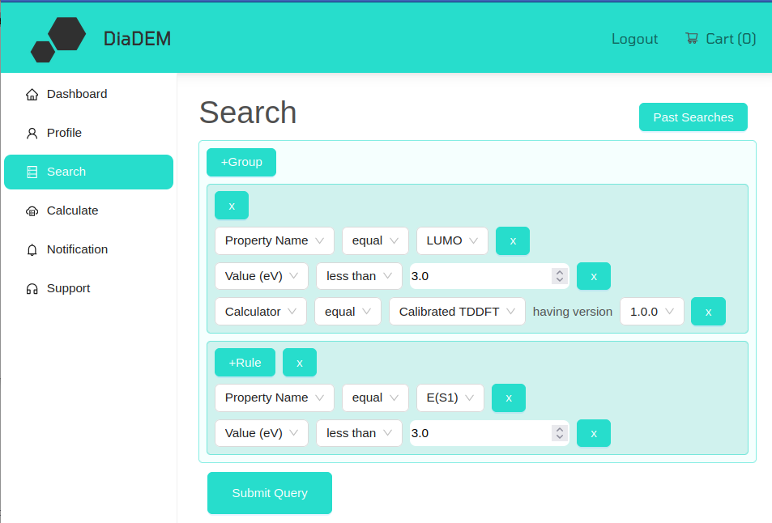
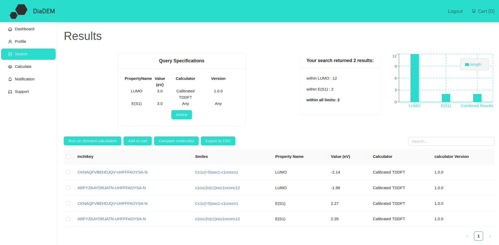

.. _manual_query:

Queries
=========

To query the DiaDEM database for molecules with specific properties, click on *Search* in the sidebar menu.

Setup new queries
-----------------
The query builder for DiaDEM is available directly via *Search* in the sidebar menu. In the query builder, you can add *Groups* and *Rules*:

**Groups**

* Each Group corresponds to a specific property. E.g. if you wish to search the database for molecules that statisfy three different properties, e.g. Lumo, S1-energy and availability, you need three groups.
* Use the *+Group* button to add a Group. A new frame with a *+Role* button will appear.
* Use the *x* button next to the *+Role* button to remove a respective Group

**Rules**

* Rules are used to define the criteria for a specific target property. You need two or three Rules per Group.
    * Specify the property (e.g. LUMO or availability) using the *Property Name* entry in the first dropdown
    * Specify the criterion for the property using the *Value* element from the first dropdown
    * Not always required: Define a specific calculator with wich the property was computed using the *Calculator* element in the first dropdown (see the note below).
* Use the *+Rule* button to add Rules
* Use the *x* button behind *each Rule* to remove a Rule. Note: Don't use the *x* button next to the *+Rule* button, as this will remove the full group.

*Note*: Some properties were computed with different calculators, potentially with different accuracy. For your specific application it may be good to specify the calculator for your search. Refer to :ref:`science_calculators` for specifications of each calculator.

**Example**
The following figure is an example of a query for two properties: LUMO<3.0eV computed with a specific calculator, and E(S1)<3.0 computed with any calculator.

Query results
--------------
When a query was submitted, the results are displayed, as in the example below:

This page provides the following content:

* The table in the top left shows the query specification
* The figure in the top right depicts, how many compounds in the database fulfil each criterion separately and combined.
* Click on any molecule (InChIKey or smiles) to view all available properties of the molecule
* Select one or multiple molecules and use the row of buttons above the table to
    * Run on-demand computations on these molecules for refinement of your query (see :ref:`manual_ondemand`)
    * Add molecules to the cart for :ref:`manual_cart`
    * Compare multiple compounds side-by-side (currently in development)
    * Export some subset of the data as a csv file
* The bottom table lists each compound that fulfills *both* criteria with the respective values of the queried properties.

Past queries
-------------------------

Past searches can be accessed via the *Past Searches* button in the query builder. You can order them ascending or descending by the date the query was submitted. If you click on any query, the respective results are reloaded.

