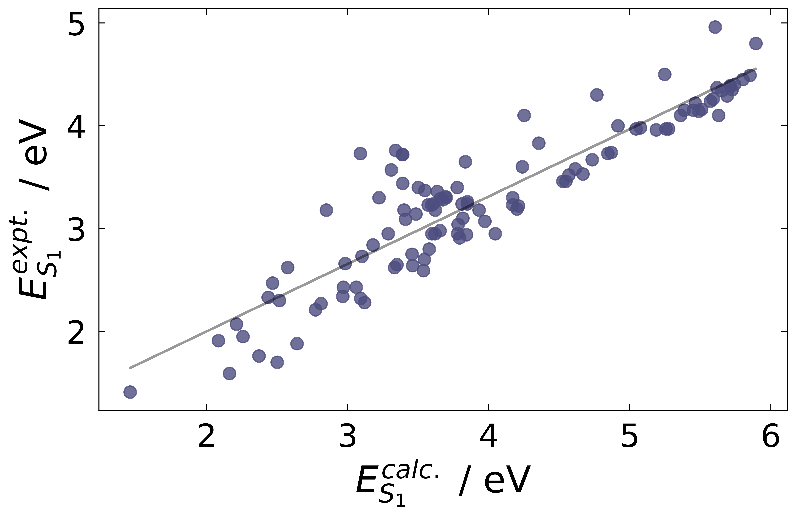
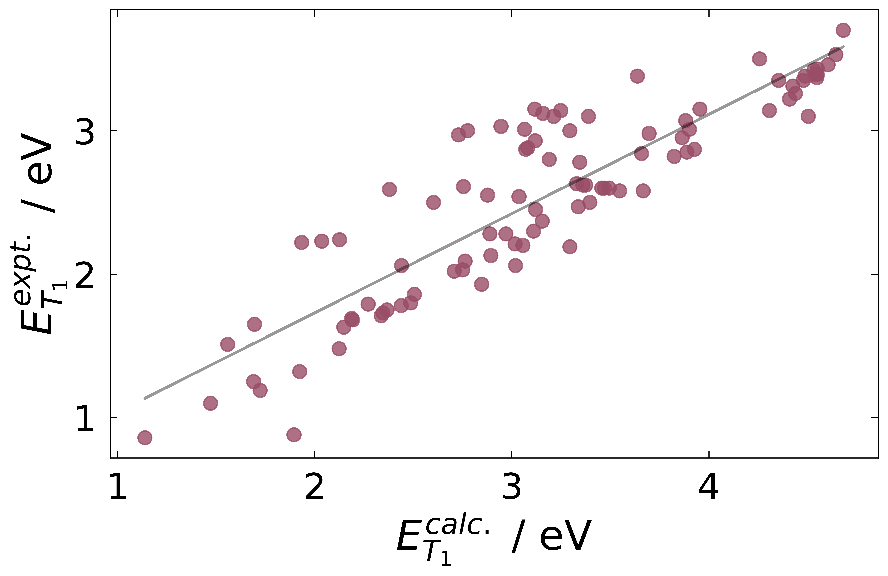

Calibrated TDDFT
=================

Calibrated TDDFT computes frontier orbital energies, vertical excitation energies and associated oscillator strengths for single molecules in vacuum.  

The protocol begins with the generation of ten energy-ranked conformers using the Universal Force Field, followed by geometry optimisation at the PM7 semi-empirical level where the lowest-energy conformer is selected for further optimization at the BLYP35/3-21G* DFT level. Finally, a TD-DFT calculation at the M06-2X/3-21G* level yields the frontier orbital energies, vertical excitation energies and associated oscillator strengths.

Calibrated TDDFT is a smaller-basis-set variant of a protocol found to be particularly effective at computing excitation energies when compared against reference high-level CC2 calculations.[a] Further plotting against experiment verifies the protocol's strong accuracy and allows for linear calibration of the vertical excitation energies to better match experimental values i.e. UV/Vis peaks. The plot for the calculated versus experimental :math:`S_{0}` → :math:`S_{1}` transition is given below, and is used for the final calibration of singlet excitation values as given in the DiaDEM database:

For triplet excitation values, the following fit is used:

Reference
----------

[a] Grotjahn, R., Maier, T. M., Michl, J. & Kaupp, M. Development of a TDDFT-Based Protocol with Local Hybrid Functionals for the Screening of Potential Singlet Fission Chromophores. J. Chem. Theory Comput. 13, 4984–4996 (2017).
