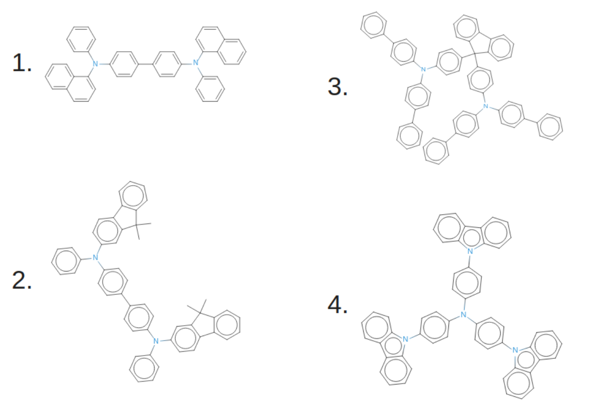
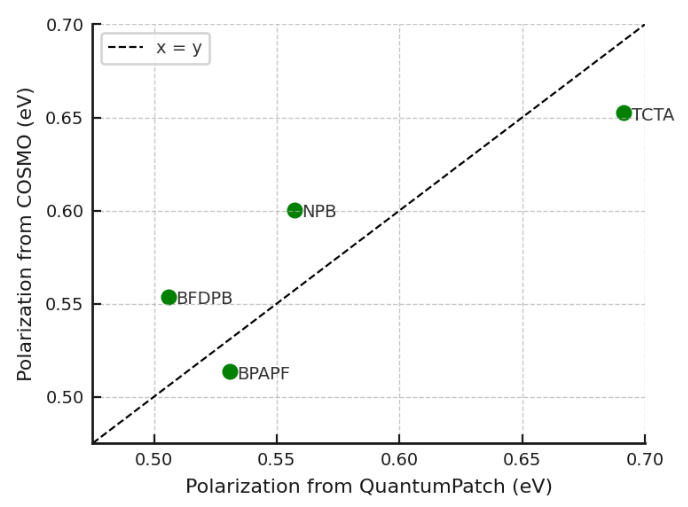

.. _science_calculators_ip_estimator:

IP/EA Estimator
===============

.. list-table::
   :header-rows: 1
   :align: center

   * - Properties
     - Notes
   * - :ref:`science_properties_ipea_estimator`
     - recommended

Workflow
--------

We make the estimation of the solid-state IP/EA of the embedded molecules using:

.. math::

    IP = IP_{GW}^{vac} - P^+_{DFT}

    EA = EA_{GW}^{vac} + P^-_{DFT}

where:

- :math:`IP_{GW}^{vac}` and :math:`EA_{GW}^{vac}` are the negative of GW HOMO and LUMO.
- :math:`P^{+}_{DFT}` and :math:`P^-_{DFT}` is the DFT-level polarization energies.

Below, more details are given on how every of these quantities is computed in practice.

Polarization Energies
~~~~~~~~~~~~~~~~~~~~~

Polarization energies are derived from *gas-phase (vacuum)* :math:`IP^{vac}_{DFT}`/:math:`EA^{vac}_{DFT}` and COSMO calculations.
The latter serve as the estimation for the *solid-state*  IP and EA, referred to as :math:`IP_{COSMO}` and :math:`EA_{COSMO}`.
The difference between both are polarization energies at a DFT level:

.. math::

   P^{+}_{DFT} = IP_{DFT}^{vac} - IP_{DFT}^{COSMO}

.. math::

   P^{-}_{DFT} = EA_{DFT}^{COSMO} - EA_{DFT}^{vac}

The mentioned :math:`IP_{DFT}^{vac/COSMO}/EA_{DFT}^{vac/COSMO}` are computed as the difference between the cation/anion energy and the
neutral molecule energy in vacuum or implicit solvent (COSMO model), respectively:

.. math::

    \text{IP} = E_{\text{cation}} - E_{\text{neutral}}

.. math::

    \text{EA} = E_{\text{neutral}} - E_{\text{anion}}

In these last formulas we omitted indices (:math:`^{vac/COSMO}` and :math:`_{DFT}`) for brevity.

Vacuum IP and EA from GW Calculations
~~~~~~~~~~~~~~~~~~~~~~~~~~~~~~~~~~~~~

:math:`IP_{GW}^{vac}` and :math:`EA_{GW}^{vac}` are computed from many-body perturbation theory using the :math:`G_0W_0`
approximation on top of PBE0 (i.e., :math:`G_0W_0` @ :math:`\text{PBE0}`). :math:`G_0W_0` slow basis set convergence is a well-known.
We thus first perform calculations using two correlation-consistent basis sets:

- aug-cc-pVDZ (DZ)
- aug-cc-pVTZ (TZ),

and then extrapolate it to the complete basis set (CBS) limit using the cardinal number :math:`N`, assuming a convergence behavior of:

.. math::

  E(\infty) = E(N) - \frac{A}{N^3},

where:

- :math:`E(N)` is the computed IP or EA using the basis set of cardinal number :math:`N`,
- :math:`E(\infty)` is the extrapolated energy at the CBS limit,
- :math:`A` is a constant that is determined along with :math:`E(\infty)` because :math:`E(N)` is known for two different :math:`N`, in our case 2(DZ) and 3(DZ).

.. list-table:: IP/EA Estimator Workflow Overview
   :widths: 30 30 30
   :header-rows: 1

   * - **Nanomatch Software**
     - **Scientific Role**
     - **Illustration**
   * - `Parametrizer <http://docs.nanomatch.de/nanomatch-modules/Parametrizer/Parametrizer.html>`_
     - | Ground State
       | Geometry optimization
     - .. image:: mobility/parametrizer.png
          :width: 150px
          :align: center
   * - `Parametrizer <http://docs.nanomatch.de/nanomatch-modules/Parametrizer/Parametrizer.html>`_
     - | IP in vacuum (DFT)
     - .. image:: stokes_shift/Parametrizer3.png
          :width: 100px
          :align: center
   * - `Parametrizer <http://docs.nanomatch.de/nanomatch-modules/Parametrizer/Parametrizer.html>`_
     - | EA in vacuum (DFT)
     - .. image:: stokes_shift/Parametrizer3.png
          :width: 100px
          :align: center
   * - `Parametrizer <http://docs.nanomatch.de/nanomatch-modules/Parametrizer/Parametrizer.html>`_
     - | IP in medium (COSMO)
     - .. image:: stokes_shift/Parametrizer3.png
          :width: 100px
          :align: center
   * - `Parametrizer <http://docs.nanomatch.de/nanomatch-modules/Parametrizer/Parametrizer.html>`_
     - | EA in medium (COSMO)
     - .. image:: stokes_shift/Parametrizer3.png
          :width: 100px
          :align: center
   * - `Parametrizer <http://docs.nanomatch.de/nanomatch-modules/Parametrizer/Parametrizer.html>`_
     - | HOMO and LUMO (GW)
     - .. image:: stokes_shift/Parametrizer3.png
          :width: 100px
          :align: center
   * - IP/EA Analysis
     - | Compute *IP* and *EA* as:
       | :math:`\mathrm{IP} = -\mathrm{HOMO}_\mathrm{GW} - P^+_\mathrm{DFT}`
       | :math:`\mathrm{EA} = -\mathrm{LUMO}_\mathrm{GW} + P^-_\mathrm{DFT}`
     - .. image:: stokes_shift/StokesShiftAnalysis.png
           :width: 100px
           :align: center

Implemented Scientific Methods
------------------------------

+---------------------------------------------------------------+-----------------------------------------------------------+
| **Step**                                                      | **Method**                                                |
+===============================================================+===========================================================+
| Ground-State Geometry Optimization                            | DFT, B3LYP/def2-SVP                                       |
+---------------------------------------------------------------+-----------------------------------------------------------+
| DFT Single Point Calculations (vacuum / COSMO)                | DFT, BP86/def2-SVPD                                       |
+---------------------------------------------------------------+-----------------------------------------------------------+
| GW Calculations in complete basis set limit                   | G₀W₀@PBE0/(aug-cc-pVDZ, aug-cc-pVTZ)                      |
+---------------------------------------------------------------+-----------------------------------------------------------+

Software:

- Quantum Chemistry: `PySCF <https://pyscf.org/>`_
- Geometry Optimization: `geomeTRIC <https://github.com/leeping/geomeTRIC>`_

Output
------

Displayed Results
~~~~~~~~~~~~~~~~~

The data below will be displayed as the workflow ends (backend name: `result.yml`):

.. code-block:: yaml

    QLQHAHDIYGVQJO-UHFFFAOYSA-N:
      EA:
        results:
          EA in eV: 2.5607947915471554
          LUMO_vacuum in eV: -1.6542377032731708
          P_minus in eV: 0.9065570882739848
        value: 2.5607947915471554
      IP:
        results:
          HOMO_vacuum in eV: -6.784890425832648
          IP in eV: 5.928143563226561
          P_plus in eV: 0.8567468626060872
        value: 5.928143563226561

Here, not only computed estimated solid-state EA/IP estimators are saved (``EA``/``IP``), but also the quantities used to calculate them:

- ``EA``/``IP`` are the solid-state values of the IP and EA.
- ``P_plus`` and ``P_minus`` are cation and anion polarization energies, respectively.
- ``HOMO_vacuum`` and ``LUMO_vacuum`` are computed in vacuum with GW method.

Files
~~~~~
In addition to parsed output, the following file are available upon the workflow completion:

.. list-table::
   :header-rows: 1
   :widths: 5 15 50

   * - No.
     - File
     - Description
   * - 1
     - `Molecule_opt.mol2`
     - Ground State geometry in MOL2 format

Benchmark
---------

Benchmark set:
~~~~~~~~~~~~~~

Molecule Names:

1. NPD
2. BFDPB
3. BPAPF
4. TCTA

Verification
~~~~~~~~~~~~

We compare the polarization energies :math:`P+` computed with this calculator to the values computed using explicit solvent model, `QuantumPatch` [1]_ as shown below:

The deviation between the reference (`QuantumPatch`) and the given method does not exceed 50 meV.

References
----------

.. _ref1:

.. [1] Neumann, T., Friederich, P., Symalla, F., Meded, V., Wenzel, W., "Simulating Charge Transport in Organic Semiconductors: From Quantum Chemistry to Device Simulation," Journal of Computational Chemistry, 34 (31), 2013, 2716-2725. URL: https://onlinelibrary.wiley.com/doi/abs/10.1002/jcc.23445.
