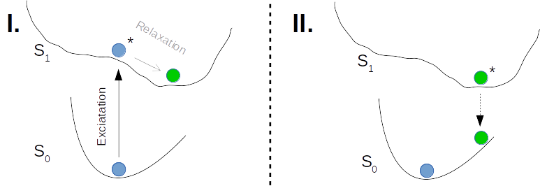

.. _science_calculators_stokesshift:

Stokes Shift Calculator
=======================

.. list-table::
   :header-rows: 1
   :align: center

   * - Properties
     - Notes
   * - :ref:`science_properties_stokes_shift`
     - recommended

Stokes Shift Calculation
------------------------

We estimate the Stokes shift in vacuum by subtracting energies of the first excited state :math:`S_1` in
:math:`S_0` geometry and :math:`S_1` geometry.

The computation of the Stokes shift is visualized in the following figure.
The left side I) shows the energy landscapes of the :math:`S_0` and :math:`S_1` states and the corresponding vertical excitation
(absorption) from the :math:`S_0` ground state. II) shows the de(-)excitation (emission) from the relaxed :math:`S_1` state.
The difference is taken as the Stokes shift.

Workflow
--------

The Stokes Shift Calculator workflow is implemented as the four separate runs of the
`Parametrizer <http://docs.nanomatch.de/nanomatch-modules/Parametrizer/Parametrizer.html>`_
Module using PySCF for quantum chemistry calculations. The last step analyzes the difference of
the :math:`E(S_1|S_0)` and :math:`E(S_1|S_1)` and deliver the final output in eV and nm.
The notations are <state>|<geometry>, where state refers to the electronic state for which the energy is evaluated,
and geometry refers to the state whose equilibrium geometry is used.

.. list-table:: Stokes Shift Workflow Overview
   :widths: 30 30 30
   :header-rows: 1

   * - **Nanomatch Software**
     - **Scientific Role**
     - **Illustration**
   * - `Parametrizer <http://docs.nanomatch.de/nanomatch-modules/Parametrizer/Parametrizer.html>`_
     - | Geometry optimization
       | in :math:`S_0` state
     - .. image:: mobility/parametrizer.png
          :width: 150px
          :align: center
   * - `Parametrizer <http://docs.nanomatch.de/nanomatch-modules/Parametrizer/Parametrizer.html>`_
     - | Geometry optimization
       | in :math:`S_1` state
     - .. image:: mobility/parametrizer.png
          :width: 150px
          :align: center
   * - `Parametrizer <http://docs.nanomatch.de/nanomatch-modules/Parametrizer/Parametrizer.html>`_
     - | Excitation Energy :math:`S_1`:
       | in :math:`S_0` geometry,
       | :math:`E(S_1|S_0)`
     - .. image:: stokes_shift/Parametrizer3.png
          :width: 100px
          :align: center
   * - `Parametrizer <http://docs.nanomatch.de/nanomatch-modules/Parametrizer/Parametrizer.html>`_
     - | Excitation Energy :math:`S_1`
       | in :math:`S_1` geometry,
       | :math:`E(S_1|S_1)`
     - .. image:: stokes_shift/Parametrizer3.png
          :width: 100px
          :align: center
   * - Stokes Shift Analysis
     - | Compute Stokes Shift as
       | :math:`E(S_1|S_0) - E(S_1|S_1)`
     - .. image:: stokes_shift/StokesShiftAnalysis.png
          :width: 100px
          :align: center

Technical details of the quantum chemistry calculations
--------------------------------------------------------

+---------------------------------------------------------------+-----------------------------+
| Step                                                          | Method                      |
+===============================================================+=============================+
| Optimization in :math:`S_0` state                             | DFT, BLYP35/def2-SVP        |
+---------------------------------------------------------------+-----------------------------+
| Optimization in :math:`S_1` state                             | TDDFT, BLYP35/def2-SVP      |
+---------------------------------------------------------------+-----------------------------+
| Excitation energy evaluation                                  | TDDFT, M06-2X/def2-SVP      |
+---------------------------------------------------------------+-----------------------------+

Software:

- Quantum Chemistry: `PySCF <https://pyscf.org/>`_
- Geometry Optimization: `geomeTRIC <https://github.com/leeping/geomeTRIC>`_

Output
------

Displayed Results
~~~~~~~~~~~~~~~~~

The data below will be displayed as the workflow ends (backend name: `result.yml`):

.. code-block:: yaml

    QLQHAHDIYGVQJO-UHFFFAOYSA-N:
      stokes_shift:
        results:
          E(S1,S0_opt) in eV: 2.933367648192653
          E(S1,S0_opt) in nm: 422.72232761686246
          E(S1,S1_opt) in eV: 2.244059764534579
          E(S1,S1_opt) in nm: 552.5699536158199
          Stokes shift in eV: 0.6893078836580742
          Stokes shift in nm: -129.84762599895748
        value: 0.6893078836580742

These represent the Stokes Shift and the excitation energies used to compute it in various units.

Files
~~~~~
In addition to parsed output, the following files are available upon the workflow completion:

.. list-table::
   :header-rows: 1
   :widths: 5 15 50

   * - No.
     - File
     - Description
   * - 1
     - `Molecule_S0_opt.mol2`
     - Ground State (:math:`S0`) geometry in MOL2 format
   * - 2
     - `Molecule_S1_opt.mol2`
     - Excited state (:math:`S1`) geometry in MOL2 format

Experimental Verification
-------------------------

