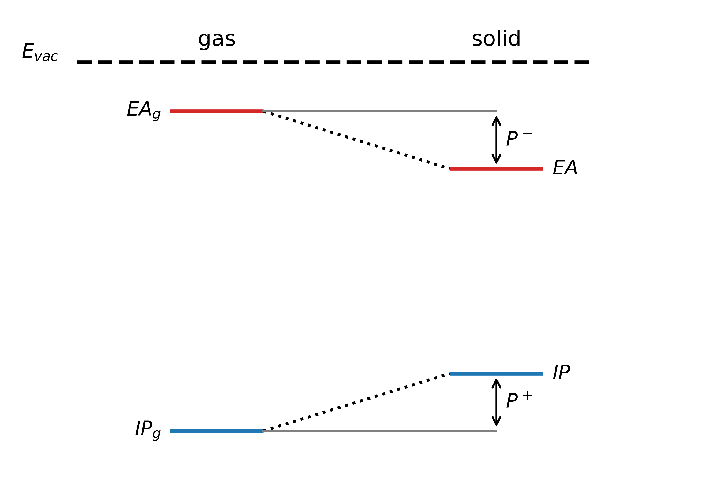

.. _science_properties_ipea_estimator:

Ionization Potential (IP) and Electron Affinity (EA) in solid-state
===================================================================

.. list-table::
   :header-rows: 1
   :align: center

   * - Calculators
     - Notes
   * - :ref:`science_calculators_ip_estimator`
     - recommended

What is IP and EA
-----------------

In organic semiconductors or similar molecular systems, the ionization potential (IP) is defined as the energy required to remove an electron from
a molecule embedded in the solid environment, while the electron affinity (EA) is the energy gained by the system when
an extra electron is added to the molecule within that environment:

.. math::

    IP = U^{+} - U^{0}

.. math::

    EA = U^{0} - U^{-}

where :math:`U^0`, :math:`U^+`, and :math:`U^-` are the energies of the neutral, positively, and negatively charged systems, respectively.

These solid-state IP and EA differ from the gas-phase values :math:`IP_{g}` and :math:`EA_{g}`, respectively, due to intermolecular interactions:

.. math::

    IP = IP_{g} - P^{+}

.. math::

    EA = EA_{g} + P^{-}

The differences :math:`P^{+}` and :math:`P^{-}` are historically called *polarization energies*, because the stabilization
in the solid state arises from induced dipoles that form in response to charging a molecule — with important exceptions
where electrostatic or other effects can be equally significant or even dominant.

The diagram below illustrates solid-state values of :math:`IP` and :math:`EA` differ from those in vacuum due to polarization energies:

Various theoretical methods exist to compute solid-state :math:`IP` and :math:`EA` [1]_, most accurate of which relying on the
separate treatment of the molecule of interest which is treated with the as accurate as possible quantum-chemistry method (normally GW),
while employing various approximations for its interaction with the environmental molecules, recognizing dominate electrostatic
nature of intermolecular interactions.
The fastest method to estimate :math:`IP` and :math:`EA` is however to use the implicit solvent model like COSMO to
capture the essential the induced polarization response and some high-level quantum chemistry method like GW to evaluate the gas-phase :math:`IP`/:math:`EA` (see :ref:`science_calculators_ip_estimator`).

References
----------

.. [1] Gabriele D’Avino, Luca Muccioli, Frédéric Castet, Carl Poelking, Denis Andrienko, Zoltán G. Soos, Jérôme Cornil, and David Beljonne,
       *Electrostatic phenomena in organic semiconductors: fundamentals and implications for photovoltaics*, J. Phys.: Condens. Matter **28**,
       433002 (2016). URL: https://iopscience.iop.org/article/10.1088/0953-8984/28/43/433002