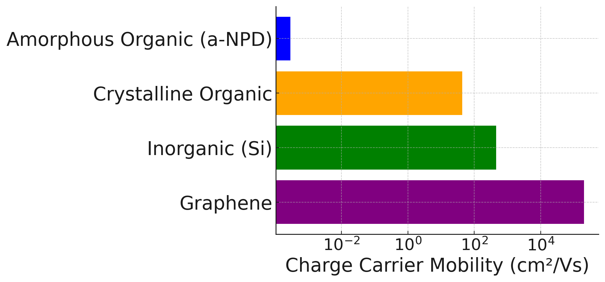

.. _science_properties_mobility:

Charge Carrier Mobility
=======================

Charge carrier mobility :math:`\mu` is a fundamental parameter in organic electronic materials, determining the speed :math:`v_d` at which charge carriers (electrons or holes) can move through a material when pushed or pulled by an electric field :math:`E`:

.. math::

    v_d = \mu \cdot E

This property is pivotal for the performance of organic electronics devices such as organic field-effect transistors (OFETs), organic photovoltaic cells (OPVs), and organic light-emitting diodes (OLEDs).

In amorphous organic semiconductors, charge carrier mobility is typically orders of magnitude lower than in other materials classes:

   Hole Mobility Comparison Across Materials Classes

This is because charge carriers cannot move smoothly in organic semiconductors as they do in crystalline materials due to the lack of long-range structural order [1]_, [2]_, [3]_, [4]_, [5]_. This disorder creates energy barriers and traps, leading to a hopping transport mechanism, where achieving the high mobility is inherently challenging because of the limited overlap of the orbitals. Additionally, organic semiconductors are more sensitive to environmental factors, which can introduce additional traps and defects, further reducing mobility [5]_.

Muti-scale origin of the mobility
---------------------------------

The structure of a molecule is a key factor in determining how molecules are packed within a morphology. Characteristics of morphology, such as mass density, radial distribution function, and structural disorder, intricately define the environment in which charge carriers move. The variability in molecular conformations and a unique embedding of every molecule within the morphology causes HOMO/LUMO disorder and smearing of the radial distribution function. This influences the energy landscape through which the carriers traverse the organic layers. The complexity of this relationship prohibits the existence of an accurate analytical formula for mobility; therefore, a multiscale workflow is employed to find mobility with satisfactory accuracy.

Nanomatch GmbH, in collaboration with research groups of Wolfgang Wenzel and Pascal Friederich at the Karlsruhe Institute of Technology, has made substantial progress in understanding the factors affecting charge carrier mobility in organic semiconductors and incorporating these factors into a multiscale simulation workflow.

Nanomatch Multiscale Workflow for Charge Carrier Mobility
---------------------------------------------------------

In the DiaDEM Platform, the Nanomatch Multiscale Workflow for mobility is employed, which includes:

- Molecule parametrization,
- Morphology deposition using a Monte-Carlo protocol mimicking physical deposition,
- Disorder and overlap integral calculations in the generated morphology,
- Mobility calculations for various applied fields and several instances of the morphology,
- Extrapolating the mobility to the zero-field limit.

as described in :ref:`science_calculators_mobility`, and benchmarked agains experimental data [2]_.

Although this workflow concentrates extensive experience and advanced simulations methods, including quantum chemistry (QM), molecular mechanics (MM), Mote-Carlo and kMC codes, the only input required from the user is the structure of the molecule, for example, inchi or another identifier. This makes it accessible to all users, regardless of their background.

The DiaDEM project allows you to compute values for charge carrier mobility, expressed in units of cm²/Vs, for any single-component organic semiconductors by simply specifying the molecule in the form of an inchi key.

Relation to Experimental Techniques
-----------------------------------

There are several experimental techniques used to determine the charge carrier mobility in organic semiconductors, including [6]_:

- **Time of Flight (TOF)**: A technique where charge carriers are generated by a short light pulse, and their transit time across the material is measured to determine mobility.
- **Field Effect Mobility (FET)**: Mobility is measured in a field-effect transistor configuration, where the gate voltage controls the carrier concentration in the channel.
- **Space-Charge Limited Current (SCLC)**: Mobility is determined from the current-voltage characteristics in the space-charge limited regime, where the current is primarily due to injected carriers filling the available states.
- **Hall Effect**: Mobility is determined by measuring the Hall voltage generated by an applied magnetic field perpendicular to the current flow.
- **Transient Electroluminescence**: Mobility is inferred from the time-resolved luminescence emitted by charge carriers as they recombine.
- **Photoconductivity Measurements**: Mobility is measured by monitoring the change in conductivity upon illumination.
- **Pulsed-Radiolysis Time-Resolved Microwave Conductivity (PR-TRMC)**: This technique uses short pulses of high-energy radiation to create transient charge carriers in the material. The subsequent changes in microwave conductivity are measured over time, providing insights into the charge carrier mobility and recombination dynamics.

Each of these techniques measures mobility under different conditions and assumptions, which can result in variability in the outcomes.

The simulation method as described below has to be compared to the TOF mobility, extrapolated to the zero-field limit assuming that the logarithm of the mobility is proportional to the squere root of the field. See Figure 3 [7]_.

References:
-----------

.. _ref1:

.. [1] Friederich, P., et al., "Molecular Origin of the Charge Carrier Mobility in Small Molecule Organic Semiconductors," Adv. Funct. Mater., 26, 2016, 5757-5763. URL: https://doi.org/10.1002/adfm.201601807.

.. _ref2:

.. [2] Keiser, S., et al., "De Novo Calculation of the Charge Carrier Mobility in Amorphous Small Molecule Organic Semiconductors," Frontiers in Chemistry, 9, 2021. URL: https://www.frontiersin.org/articles/10.3389/fchem.2021.801589.

.. _ref3:

.. [3] Friederich, P., et al., "Rational In Silico Design of an Organic Semiconductor with Improved Electron Mobility," Adv. Mater., 2017, 29, 1703505. URL: https://doi.org/10.1002/adma.201703505.

.. _ref4:

.. [4] Kotadiya, N. B., et al., "Rigorous Characterization and Predictive Modeling of Hole Transport in Amorphous Organic Semiconductors," Adv. Electron. Mater. (2018), 4, 1800366. URL: https://doi.org/10.1002/aelm.201800366.

.. _ref5:

.. [5] Friederich, P., et al., "The influence of impurities on the charge carrier mobility of small molecule organic semiconductors," arXiv, (2020). URL: https://ar5iv.org/abs/1908.11854v2.

.. _ref6:

.. [6] Kokil, A., Yang, K. and Kumar, J., (2012), Techniques for characterization of charge carrier mobility in organic semiconductors. J. Polym. Sci. B Polym. Phys., 50: 1130-1144. URL: https://doi.org/10.1002/polb.23103.

.. _ref7:

.. [7] Miyashige, K., Morimoto, M. and Naka, S. (2021), Carrier Mobilities in Amorphous Organic Semiconductor Films Prepared at Various Film Formation Processes. Phys. Status Solidi A, 218: 2100330. URL: https://doi.org/10.1002/pssa.202100330, https://toyama.repo.nii.ac.jp/record/19823/files/23.pssa.202100330_draft.pdf

